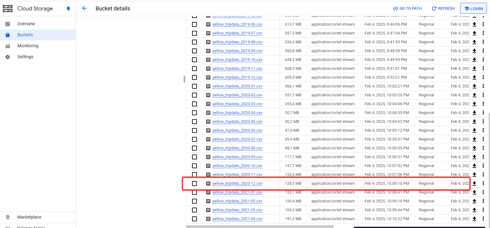

# Module 2 Homework Solution

## Setup

I have set up my environment in the cloud using:
* Google Compute Engine - VM instance to run Kestra
* Google Cloud Storage - for Kestra operational storage
* Google Cloud SQL - Postgres database for Kestra

I have followed the instructions from Kestra docs, available [here](https://kestra.io/docs/installation/gcp-vm)

After installing the Kestra I have followed the videos and yaml files for flows provided in the course repository. 
Adjustments needed:
1. It seems that Kestra does not recognize provided external Postgres database as `host.docker.internal`, which makes sens, as it is not being run in the same docker group. However, providing internal IP of the database worked for the flows that used Postgres as destination.
2. Just to be sure, I need to convert host IP, passwords, etc. to key-value store in order to avoid security breach, as these resources are available online.

## Homework prep

I especially liked the solution with GCS and BigQuery, as it seems to be the closest to real environment and also because my laptop was giving out on me with the yellow dataset.

I used `06_gcp_taxi_scheduled.yaml` flow and backfilled the yellow and green dataset and loaded it into GCS and BigQuery.

## Quiz questions
### 1. Within the execution for Yellow Taxi data for the year 2020 and month 12: what is the uncompressed file size (i.e. the output file yellow_tripdata_2020-12.csv of the extract task)?

As I have kept the task to purge files after exection, I've looked for the information on that in the GCS, where the file was uploaded after exctraction.
Because the task uncompresses the csv, the size of the file is 128,3 MB.

### 2. What is the rendered value of the variable file when the inputs taxi is set to green, year is set to 2020, and month is set to 04 during execution?

The rendered value refers to the value after converting variables to text, and as seen in the file name. As we can see in the screenshot above, the second answer: `green_tripdata_2020-04.csv` is correct.

### 3. How many rows are there for the Yellow Taxi data for all CSV files in the year 2020?

To quickly check that we can utilize the dataset in the BigQuery and write SQL query.

I have attached it in the sql_scripts folder, but the answer is 24,648,499.

### 4. How many rows are there for the Green Taxi data for all CSV files in the year 2020?

In similar vein to the above, the relevant SQL script is in the folder, but the answer is 1,734,051.

### 5. How many rows are there for the Yellow Taxi data for the March 2021 CSV file?

Aaand yes, I have prepared SQL script and the answer is 1,925,152

### 6. How would you configure the timezone to New York in a Schedule trigger?

[Relevant page in the Kestra docs](https://kestra.io/docs/workflow-components/triggers/schedule-trigger) suggests that the way to do this is to add `timezone` property of value `America/New_York` 